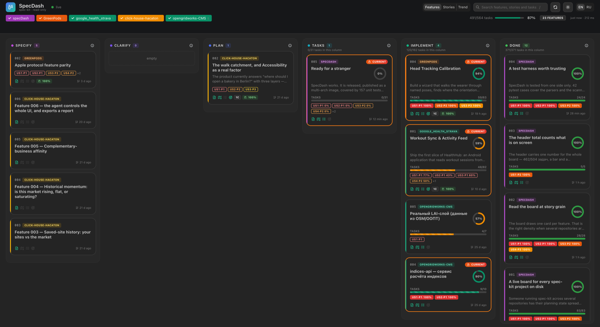
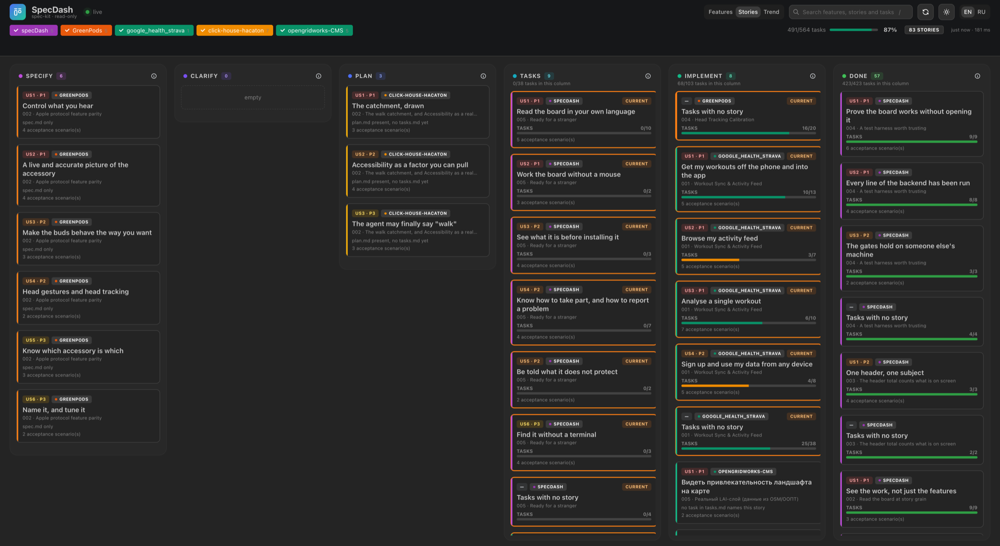
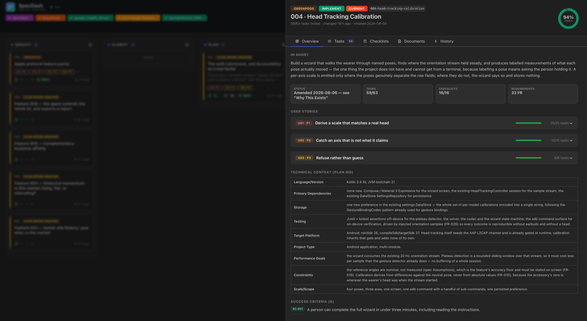
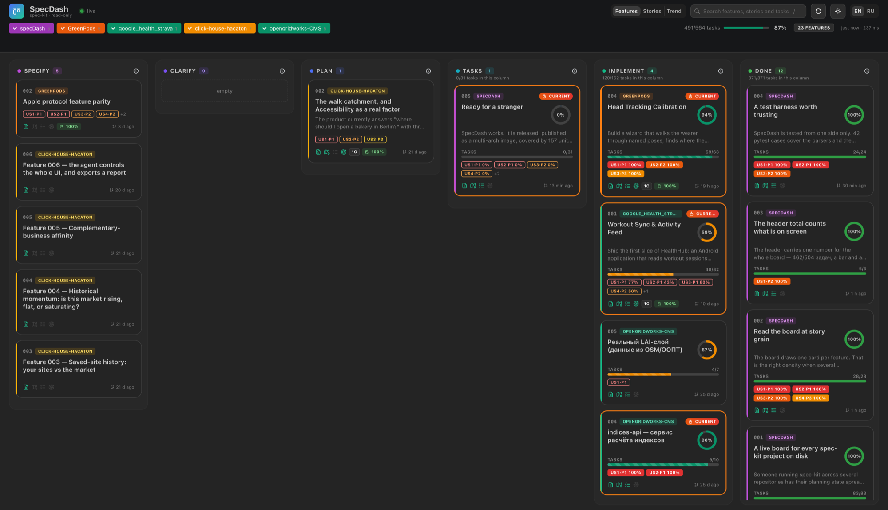
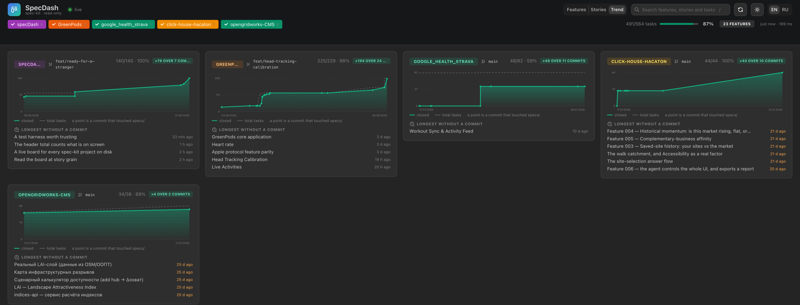

<div align="center">

# SpecDash

**A live, read-only board for every [spec-kit](https://github.com/github/spec-kit) project on your disk.**

[](https://github.com/andrewkomkov/specdash/actions/workflows/ci.yml)
[](https://github.com/andrewkomkov/specdash/releases)
[](https://github.com/andrewkomkov/specdash/pkgs/container/specdash)
[](backend/pytest.ini)
[](LICENSE)

**[specdash on the web →](https://andrewkomkov.github.io/specdash/)**

Point it at the directory where you keep your repositories. It finds every spec-kit project
underneath, lays each feature out across the six stages of the pipeline, and follows the
files as your agent writes them. It never writes back.



</div>

## Run it

```bash
docker run -d --name specdash -p 127.0.0.1:8420:8420 \
  -v "$HOME/projects:/projects:ro" \
  -e WATCHFILES_FORCE_POLLING=1 \
  ghcr.io/andrewkomkov/specdash:latest
```

Then open <http://localhost:8420>. One image, one port, no configuration per project, no
database, no internet. Or clone the repository and use compose:

```bash
cp .env.example .env      # set PROJECTS_ROOT
docker compose up -d
```

## What it shows

**Every card says why it is where it is.** `all 38 tasks ticked`, `plan.md present, no
tasks.md yet`, `2 open clarification marker(s)`. Placement comes from the artefacts on disk,
and the artefacts outrank the prose: a spec that still says "ready for planning" over a
fully ticked `tasks.md` lands in Done, because a checkbox is a claim about code.

### Read it at two grains

One card per feature is right when several projects are open at once. One card per **user
story** is right when a handful of features would otherwise leave the columns nearly empty —
each story placed by its *own* ticked tasks rather than by its feature's. Setup, foundational
and polish tasks name no story, so they get a card of their own; without it the column totals
would quietly stop adding up.



### Open a card for the whole feature

User stories with their acceptance scenarios, the technical context, requirements, success
criteria and open questions — and the task list grouped by phase or by story, filterable to
the unfinished. Every document in the feature folder is rendered in place.





### See whether anything is moving

Task completion per commit, read straight out of `git log` — no database, nothing stored.
The dashed line is the total, because work being added is half the story and a chart of
percentages alone hides it. Underneath, the feature folders no commit has touched in
longest. A project that is not under git says so rather than drawing an empty chart.



### Search what is written, not just what is titled

Press **⌘K** and search across every specification, plan, research note and contract — the
text, ranked, with the matching line shown. The board's own filter narrows cards from the
snapshot in your browser; the snapshot has never carried document bodies, so this is the only
way to find a sentence someone wrote in a `plan.md` eighteen months ago.

Partial words match by prefix, substrings fall back to a trigram index, and a misspelling is
answered with a correction rather than an empty page. It is SQLite's FTS5, which was already
in the image's standard library: **no dependency was added and nothing is fetched.** The index
is rebuilt with every scan and lives only in memory — an index file would have been the first
thing SpecDash ever wrote.

### It updates itself

Run `/speckit-tasks` in one window with the board open in another: progress moves, cards
change column, and whatever just changed pulses. No reload, no button.

### It speaks your language

English and Russian, taken from the browser and switchable in the header. Your own writing —
feature titles, task text, summaries — is never translated. It is your document, not our
copy.

## Read-only, structurally

The projects you point it at are your real work. SpecDash treats them as someone else's:

- the code only ever opens files for reading — there is no write path, no cache file, no
  lock file, no "fixing" a malformed document;
- `docker-compose.yml` mounts every project path `:ro`, so the kernel refuses a write even
  if a future line of code asks for one;
- the container runs `read_only`, non-root, with `no-new-privileges`;
- git is limited to a read-only subcommand allow-list with `--no-optional-locks`, so no
  `index.lock` can appear in your working tree while you are mid-rebase;
- every checkbox on screen is genuinely read-only. There is no drag-and-drop between
  columns, because moving a card would mean editing your files.

Verify it yourself — CI does exactly this on every build and fails if the write succeeds:

```bash
docker compose exec specdash sh -c 'touch /projects/some-repo/specs/PROOF'
# touch: /projects/some-repo/specs/PROOF: Read-only file system
```

The page also loads nothing from the internet — no CDN, no fonts, no telemetry.

## What it does not protect

**SpecDash has no authentication.** No login, no token, no per-project permission. Anyone who
can reach the port can read every specification, plan and task list under the mounted root.

The container listens on every interface inside itself, so how you publish the port decides
who can read your specs. Both commands above bind to `127.0.0.1` deliberately. If you want it
reachable from elsewhere, put something in front that asks who is calling.

See [SECURITY.md](SECURITY.md) for the rest of the threat model.

## Configuration

All of it is optional except the first line.

| Variable | Default | Meaning |
| --- | --- | --- |
| `PROJECTS_ROOT` | *(required)* | host directory mounted read-only at `/projects` |
| `SPECDASH_BIND` | `127.0.0.1` | host interface to publish on — `0.0.0.0` exposes the board to your network |
| `SPECDASH_PORT` | `8420` | host port |
| `SPECDASH_MAX_DEPTH` | `2` | how deep under the root to look for projects |
| `SPECDASH_POLLING` | `1` | poll for changes instead of using inotify — required on macOS and Windows, where bind mounts do not deliver inotify events |
| `SPECDASH_POLL_DELAY_MS` | `800` | polling interval |
| `SPECDASH_GIT` | `1` | read branch and history with git |
| `SPECDASH_HISTORY_COMMITS` | `200` | how far back the trend view walks |
| `SPECDASH_ROOTS` | `/projects` | scan roots inside the container |
| `SPECDASH_PROJECTS` | — | explicit project paths, instead of or alongside discovery |

A project is any directory holding `.specify/` or `specs/`. Adding one means creating it —
there is nothing to register, and it appears without a restart.

## Development

```bash
cd backend
python3.13 -m venv .venv && .venv/bin/pip install -r requirements-dev.txt
SPECDASH_ROOTS=$HOME/projects .venv/bin/python -m uvicorn app.main:app --reload --port 8420

cd frontend && npm install && npm run dev    # :5173, proxies /api and /ws
```

Backend is FastAPI + pydantic + watchfiles; frontend is React 19 + Mantine 8 + Vite. The
domain model lives in `backend/app/models.py` and is mirrored in `frontend/src/types.ts`.
The HTTP and websocket surface is documented in
[`contracts/http-api.md`](specs/001-spec-kit-live-board/contracts/http-api.md).

### The gates

```bash
cd backend  && .venv/bin/python -m pytest && .venv/bin/ruff check app tests
cd frontend && npm run build && npm run lint
cd e2e      && npm ci && npx playwright install chromium && npx playwright test
```

The backend suite is fixtures of the drift found in real spec-kit output — wrapped values,
`SC-005a`, checkboxes in sections that are not tasks, a `tasks.md` with no ids at all — plus
the properties most expensive to get wrong: that a spec's prose never outranks its task list,
that no `doc?file=` traversal escapes a project, and that a full scan leaves the scanned tree
byte for byte identical. Coverage is pinned at 100% in `pytest.ini`. That is a floor, not a
claim of correctness: it says every line has been executed, not that every behaviour is right.

The end-to-end suite drives the real application in a real browser against a checked-in
fixture workspace — 45 cases in about twenty seconds. Nothing is mocked, because every
interesting failure this project has had was at the seam between a parser and the screen.

See [CONTRIBUTING.md](CONTRIBUTING.md) before opening a pull request.

## It is a spec-kit project itself

SpecDash is specified the way it expects its subjects to be — see [`specs/`](specs/) for
every feature's spec, plan and task list, and
[`.specify/memory/constitution.md`](.specify/memory/constitution.md) for the rules the code
is held to. Point it at the folder containing this repository and it will show you itself,
which is how the omission behind feature `002` was noticed.

## Releasing

Conventional commits on `main` drive a rolling release-please pull request; merging it tags
the release, which builds and pushes the multi-arch image. The registry is ghcr, so
publishing authenticates with the workflow's own token and no long-lived registry secret
exists anywhere in this repository.

## Licence

MIT — see [LICENSE](LICENSE).
